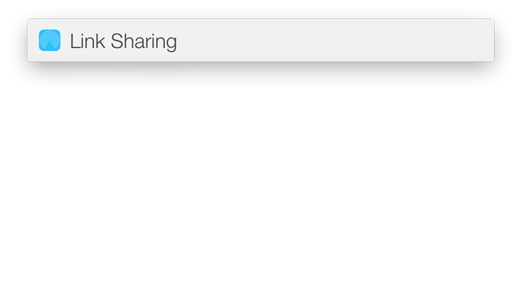

# Link Sharing: convert any smb/cifs/afp/win/unix links

This action - the sharing link converter. If someone send you a link, like \\server\share, you could easily convert it for Finder support.

## Features
* Input: smb, cifs, windows sharing, unix links
* Copy one or multiple links

 
## Installation
* Click "Download ZIP" on the right
* Run LaunchBar/Link Sharing.lbaction to install

