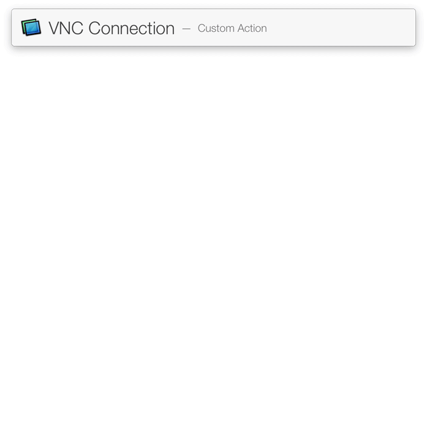

# VNC History: Screen Sharing.app history viewer with auto substitution

This action - the viewer of history of screen sharing connections.

## Features
* Get connections from *.vncloc files
* Auto substitution

## Installation
* Click "Download ZIP" on the right
* Run LaunchBar/Screen Sharing.lbaction to install

